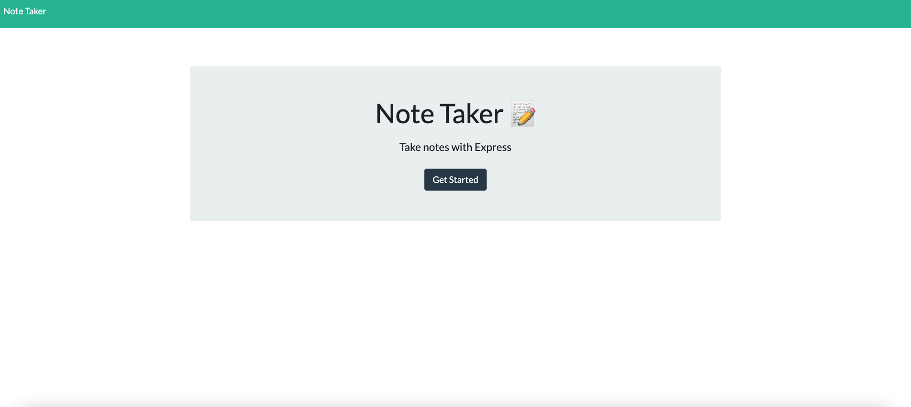

# note-taker

## Description

This project allows a user to write and save notes that can be viewed later even if the browser window is closed. I used express to enable fetch requests and manipulation of locally stored data in the db.json file. This ensures the the notes are saved in a manner that is not reliant on a particular browser (like local storage).

I felt that despite this assigment taking relatively few hours to complete, the mapping of the different files and syntax required to properly import different files confused me more than any project to date. Hopefully that's just a symptom of it being the first week of back end development.

## Table of Contents 

[Installation](#Installation)
    
[Usage](#Usage)
    
[License](#License)
    
[Constributing](#Constributing)
    
[Tests](#Tests)
    
[Questions](#Questions)
    
    
## Installation
    
No installation required
    
    
## Usage
    
To use, visit https://note-taker-hcw.herokuapp.com/

    
    
## License 
    
GitHub
    
    
## Contribution 
    
To contribute, contact me!
    
    
## Tests
    
No testing required    
    
## Questions
    
For questions, email me at: henryweigand10@gmail.com
    
Or, checkout my [github!](github.com/hcweigand10)